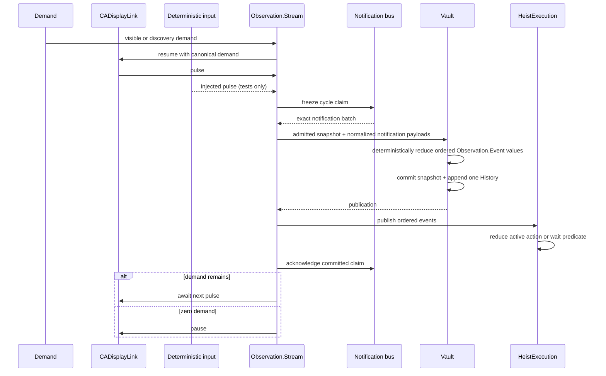
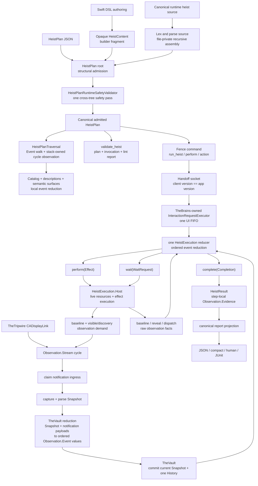

# The Button Heist architecture

The Button Heist lets callers write programs against an app's accessibility
contract. Semantic intent enters the runtime; The Button Heist owns target
resolution, reveal, element inflation, action execution, observation, and
evidence; callers receive admitted semantic evidence for validation,
reporting, or the next step.

This document names the load-bearing runtime pieces. The canonical product
contract and conformance cases live in [Accessibility Contract](ACCESSIBILITY-CONTRACT.md).
For exhaustive command shapes, wire payloads, and per-module implementation
notes, use the generated or reference docs linked at the end.

## Visual Architecture

The architecture is maintained as executable Mermaid source, one concern per
diagram. Start with the [system topology](diagrams/system-topology.md), then
follow the part of the pipeline you are changing:

| Concern | Canonical diagram |
| --- | --- |
| Modules, processes, and the wire | [System topology](diagrams/system-topology.md), [crew map](diagrams/crew-map.md), and [process boundaries](diagrams/process-boundaries.md) |
| Plan authoring, admission, and traversal | [Heist lifecycle](diagrams/heist-lifecycle.md) and [DSL grammar](diagrams/dsl-grammar.md) |
| Actions, waits, and terminal evidence | [Action pipeline](diagrams/action-pipeline.md) and [observation pipeline](diagrams/observation-pipeline.md) |
| Current truth and ordered change | [Observation pipeline](diagrams/observation-pipeline.md) |
| Target resolution and viewport exploration | [Element inflation](diagrams/element-inflation.md) |
| Transport admission and main-thread liveness | [Transport control plane](diagrams/transport-control-plane.md) |
| Test orchestration and simulator admission | [Test runner](diagrams/test-runner.md) |

These are architectural contracts, not review snapshots. A responsibility,
state-machine, wire, result, language, or runner change updates its diagram in
the same pull request.

## Product Contracts

### Strings Only at Edges

There is one product command contract: `TheFence.Command`. CLI arguments, MCP
JSON, session JSON, and heist files accept canonical command strings such as
`action`, `perform`, and `run_heist`; those strings are parsed once at the
boundary and routed as typed values inside the stack. The `action` payload then
decodes once into the canonical `HeistActionCommand` enum.

Raw command dictionaries end at Fence admission. `FenceCommandInput` is the
unadmitted edge value; `AdmittedFenceCommand` contains the typed
`CommandExecution` that execution consumes.

Raw machine JSON is size- and shape-checked at the Foundation boundary, then
decoded directly into its destination contract. MCP converts its existing
`Value` tree directly into `HeistValue`; the same encoded-input check applies
the byte, depth, and key-count limits. There is no Button Heist JSON AST or
format-specific recursive node between either boundary and command admission.
JSON-lines executes one request at a time, so stream order is its correlation
contract; it has no second request-ID envelope.

ButtonHeistMCP projects one tool per exposed Fence command from the same
contract. Fence payload decoding maps malformed nested values, including
predicates, to one field-qualified `SchemaValidationError` path. Responses flow
back through `FenceResponse.jsonRendering`; CLI and MCP consume that rendering
and its bounded fallback instead of defining adapter-specific outcome shapes.
Wire message discriminators live one layer lower in TheScore and are documented
separately.

Typed `FenceCommandDescriptor` values are the sole owners of public command
shape. The committed public CLI/MCP command-contract JSON is generated only as
a drift sentinel; it is not a second schema.

ThePlans admits public payload values before they enter a command. Gesture and
wait durations are backed by one bounded-seconds primitive with domain-specific
bounds. Authored strings use distinct currencies for text input, pasteboard
content, custom action names, rotor names, warnings, and failures. Exact
nonblank currencies share the `NonBlankStringValue` construction and
single-value JSON mechanics but remain distinct concrete types that cannot be
interchanged. Text input and pasteboard values retain their different validity
rules. Public Swift construction and decoding call each currency's validating
initializer. Execution therefore consumes admitted values directly and never
clamps or repairs them.

Wire identities follow the same rule. Envelopes decode version and correlation
strings into `ButtonHeistVersion` and `RequestID`; authentication and session
ownership use `SessionAuthToken`, `DriverID`, and `SessionOwner`. These values
encode as single JSON strings but are not interchangeable strings in core logic.

### Trees and Observations Are the Currency

The committed `TheVault.interfaceTree` is the sole current semantic truth.
TheVault privately projects that tree into `AccessibilityTargetMatchInput`; the
shared `AccessibilityTargetMatchGraph` evaluates every element, container,
ordinal, and descendant-scoped `AccessibilityTarget`. TheVault maps the result
paths back to `InterfaceTree` values and current live evidence for diagnostics,
inflation, and dispatch. A delivered `Interface` feeds the same matching graph,
so client predicates and host resolution cannot drift into separate recursive
implementations. `InterfaceGraph` remains the validated structural projection
used for formatting and hierarchy operations. There is no semantic back map,
alternate flat screen, or second target-matching projection.
Its admission boundary proves that every element path has one canonical
geometry-and-action annotation; element records expose that annotation as a
non-optional value to all later projections.

Parser element actions and custom content are normalized once before any
consumer sees them. `AccessibilityElement.projectedActionSet` is the sole
action projection used by matching, capability diagnostics, wire conversion,
and discovery grafting; live UIKit evidence may only augment that semantic
projection. `AccessibilityElement.projectedCustomContent` is likewise shared by
matching, diagnostics, and wire conversion. Those consumers do not independently
reinterpret parser fields.

`InterfaceObservation` pairs an `InterfaceTree`, including its value-only
viewport capture, with viewport-local `LiveCapture` dispatch references from
one parser read. Raw parser samples remain live or diagnostic evidence; they
never append temporal history and
do not become targetable semantic truth by themselves. Capture admission
normalizes the sample into `Observation.Snapshot`; UIKit objects remain
capture-boundary evidence and are never durable identity.

The Vault is the sole semantic state owner. It holds the current
`Observation.Snapshot` and one ordered `Observation.History`. It admits a
capture, classifies continuity, constructs the corresponding
`Observation.Event`, commits current truth, records the event, and only then
publishes it. There is no parser-to-history path, subscriber-driven graph
mutation, compatibility reducer, or second runtime state projection.

The stream is also the one observation producer. In production, TheTripwire's
persistent `CADisplayLink` samples UIKit and supplies complete serialized pulse
readings only while stream demand is nonzero. Deterministic execution selects
injected pulse ingress and delivers the same typed reading without starting a
display link or sampling a clock or UIKit. One pulse starts one
claim/capture/parse/commit/publish/evaluate cycle;
concurrent consumers join it. Once a Vault commit installs admitted-read state,
waits and action before-state acquisition reuse the committed event until the
next pulse, explicit invalidation, or screen replacement. After-action and
discovery freshness always request a publication from the same producer.

`Observation.History` is the Vault-owned ordered array of
`Observation.Event` values. `elementsChanged` contains its immutable snapshot;
`screenChanged` is the only screen-boundary marker. The running heist reducer
may retain ordinary private positions while advancing, but positions never
enter snapshots, events, state answers, or an API. No predicate, action, or
adapter owns another history or temporal record.

A raw parser read may replace live object and geometry evidence, but only a
`HeistId` resolved from the committed `InterfaceTree` can select that evidence
for action. Parsed nodes do not become targetable until a proven commit.
`HeistId` is a capture-local join key, not identity across committed captures.
When reveal crosses a capture boundary, element inflation admits one
`AdmittedSemanticTarget`: the resolved target with its terminal ordinal removed,
but only when that target uniquely resolves to the originally selected element
in the complete committed interface. Every later committed capture re-resolves
that semantic target and adopts the matching element's current `HeistId` for
live UIKit handoff. Missing or ambiguous re-resolution fails safely; it never
retains the previous id or substitutes a sibling duplicate.

Screen-space geometry belongs to one settled viewport. A viewport move ends
its lifetime, and the next committed capture supplies new screen-space
geometry. Parent-space geometry has a longer but limited lifetime and is one
atomic state: available with an owner path, frame, and activation point from
the same parent-layout snapshot, or invalidated with neither geometry value.
It may cross viewport moves while the layout and screen stay the same. A layout
or screen change invalidates the complete parent-space state. Before using
retained parent-space geometry, TheInsideJob must find exactly one matching
semantic owner in the current capture. The owner's tree path may change, and a
matching reacquisition restores only a fresh complete value for that owner. A
missing, ambiguous, or nonmatching owner keeps the state invalidated.

Completed steps project immutable `Observation.Evidence` from Vault truth and
the events consumed by the reducer. Current-state predicates read the current
snapshot through the same target resolver that actions and `get_interface` use.
Diagnostic evidence is result-local; it is not committed or targetable. A
public response may expose a compact `delta`, but that value is a one-way,
lossy fold of ordered events and is never fed back into predicate evaluation.

Agents should start from `get_interface`, then inspect an action result's public
delta before issuing another read. After a screen change, build follow-up
targets from the new interface evidence. See the
[currency types diagram](diagrams/currency-types.md) for the type families and
the [observation pipeline diagram](diagrams/observation-pipeline.md) for the
capture, event, predicate, and public-fold boundaries.

### One Heist Reducer

TheTripwire samples UIKit timing signals: presentation-layer movement, pending
layout, animations, top view-controller identity, navigation state, window
ordering, keyboard state, and first responder state. It never classifies the
accessibility tree.

```swift
enum HeistExecution.Decision {
    case perform(Effect)
    case wait(WaitRequest)
    case complete(Completion)
}
```

One `HeistExecution` value reduces one complete heist from its first step to its
final `Completion`. It privately retains the control-flow stack, environments,
step results, expectation progress, deadlines, and observation progress.
`State` is its private durable phase. Each call to `start(at:timeout:)` or
`reduce(_:)` returns one `Decision`: perform a typed `Effect`, wait for a fact
with a stable ID and absolute deadline, or complete.

The Vault reducer accepts admitted snapshots and normalized notification
payloads and deterministically produces ordered `Observation.Event` values.
The reducer accepts baseline snapshots, those events, and typed outcomes from
effects it previously returned. For a fixed heist and event order, it returns
the same decisions. There is no second command API, operation result,
caller-provided baseline, history-start argument, or execution owner. Actions
and waits are private reducer progress, not separate executors.

`HeistExecution` owns the original leaf and whole-heist deadlines. It gives each
boundary operation the earlier absolute deadline, but keeps both original
values so it can classify leaf and heist timeouts correctly.
`HeistExecution.Host` owns elapsed-time reads, cancellable waits, UIKit work,
action dispatch, viewport exploration, subscriptions, notification leases,
and failure capture. Production binds those operations to live code.
Deterministic scenarios bind virtual time and scripted platform effects while
retaining the real reducer and host.

The leaf deadline starts before baseline acquisition and covers reveal,
dispatch, expectation evaluation, and the trailing `noChange` required to close
the observation. There is no separate readiness allowance. The host reports
clock and capture facts. The reducer decides whether the leaf deadline, the
whole-heist deadline, or neither has expired. A leaf timeout may enter an
authored wait `else`; a heist timeout permits no further authored effect.
Deadline facts never enter the Vault or `Observation.History`.

Observation close has two phases. The reducer asks the host for one coverage,
refresh, or next-cycle sample. The host returns raw evidence, viewport status,
capture availability, and event times. The reducer decides whether to request
another sample or commit. The host keeps the sealed notification lease until a
commit or cancellation effect releases it. The host never evaluates an
expectation or constructs `LeafOutcome`.

Cancellation remains inside the reducer. During active work, the host sends
`cancellationRequested`. The reducer returns one `cancelObservation` cleanup
effect, admits its matching completion fact, and completes with `.cancelled`.
During failure capture, cancellation skips the optional evidence and completes
with `.cancelled`. A capture admitted first completes the failed result. A
cancellation admitted first absorbs a late capture. The host uses a
cancellation-aware one-shot for failure capture. Thus, the host does not wait
for the capture operation to return after cancellation. The live boundary
completes one observation cycle and honors task cancellation. The host then
throws `CancellationError` to the caller.

### Canonical pipeline boundaries

Swift access control preserves four construction boundaries:

- `TouchEvent` has a private initializer. Its `dispatch(touches:)` operation
  constructs each event. `SafecrackerTouchInjection` owns the complete gesture
  from `began` through one terminal `ended` or `cancelled` event. Cancellation
  before `began` sends no touch event.
- `HeistSwiftFileCompilation` has a private initializer. Its static `compile`
  operation owns construction. The compiler resolves `ThePlans` only from an
  absolute override, an explicit package root, or the exact installed prefix.
  An explicit package root asks SwiftPM for its active binary directory; the
  compiler does not guess debug, release, host-triple, or legacy layouts.
- `HeistExecutionBudget` has a private initializer. Its `project` operation
  creates one budget before transport dispatch. It adds transport headroom only
  to the client wait.
- `HeistReport` has a private initializer. `project(result:)` derives the one
  presentation model from execution truth.

The compiler rejects direct construction outside these declarations. Bumper
does not repeat that check. Behavioral tests remain responsible for each
currency's meaning.

Lifecycle effects follow the same ownership rule. The reducer returns an
ordered effect list, one host executor performs that list, and notification
bridges only schedule the executor. Transport-wiring and observation race
controls are immutable construction-time boundaries. Production uses their
immediate values, while deterministic tests inject controlled suspension
points.

Failure evidence is finalized by the same reducer. Whenever executed root
children contain an `abortedAtPath` and screenshot evidence is enabled, the
reducer returns one `captureFailureScreenshot` effect before completing.
The host captures the screen and returns `failureScreenshotCaptured` to that
reducer. Explicit `Fail`, action or expectation failure, wait failure,
control-flow failure, runtime unavailability, viewport restoration failure, and
deadline expiry all use this path. A screenshot failure is auxiliary evidence;
it never replaces the original failed path.

One pure `ScreenClassifier` combines typed snapshots with scoped
`screenChanged`, `layoutChanged`, `elementUpdate`, and `announcement`
notifications.
The process callback crosses onto `MainActor` once and delivers to the one bus
owned by the live Vault. `AccessibilityNotificationBus` assigns sequence and
appends package-internal ingress records to its bounded log. `Observation.Stream`
freezes one exact claim at the start of each observation cycle. That claim is
the only notification input to the cycle and stays pending until the
corresponding semantic observation commits.
An unavailable capture does not manufacture an event or advance notification
admission; the same claim remains eligible for the next demanded pulse. A
retention gap starts a new explicit observation baseline rather than presenting
incomplete ingress as `noChange`.



Notifications are edge evidence, not a second state model. A scoped screen
notification is authoritative replacement evidence. Without one, typed
snapshot comparison may infer replacement; element and announcement
notifications do not veto that inference. The classifier represents its
decision internally as `ScreenContinuity`; the admitted event carries only
normalized `ScreenFacts`. Notification delivery is best effort, and absence is
not evidence of replacement or stability.

The runtime classifies accessibility state, not animations. One persistent
`CADisplayLink` in TheTripwire is the sole live observation clock. Scope pressure
is reduced to one pulse demand; zero demand pauses the link. Injected ingress is
used only by deterministic execution and never starts that live clock. A pulse starts at most
one capture cycle, and pulses received while that synchronous cycle is active
are dropped. A later display pulse starts the next demanded cycle. The cycle
claims notifications, captures and parses live UIKit state, commits snapshot and
history, then publishes ordered events to `HeistExecution`. A fresh capture
that proves complete observed equality produces `noChange`. That case has no
payload, but it means neither semantic state nor geometry changed within the
admitted comparison tolerance.
Motion with no accessibility representation is not execution evidence. Business
deadlines may cancel work, but no timer, sleep, caller loop, or discovery path
acts as a second observation clock.

`ServerTransport.transportEvents` has one
off-main consumer, `TransportControlPlane`. That control plane performs
per-client admission without entering `MainActor`. Authenticated `ping` and
`mainThreadProbe` requests remain on this transport-control sideband. Admitted
`status` and UI requests cross one bounded, capacity-admitted stream onto
`MainActor`. The control plane retains ended leases and transport-overflow
facts, coalesces them behind at most one control wake-up, and clears them only
when `MainActor` consumes that wake-up. UI work then enters the existing single
`TheBrains` interaction executor.

Each client connection receives a monotonically issued `TransportClientLease`.
The control plane invalidates that lease before publishing disconnect or
overflow effects. Buffered UI work must present the current lease both when the
MainActor consumes it and immediately before TheBrains executes it, so a reused
client ID cannot revive work from an earlier connection. At the socket boundary,
each request's response handler reserves its send against the exact
`NWConnection` that supplied the request, so a stale response cannot target a
replacement connection. Replacing transport wiring shares one cleanup task
across competing attempts and drains prior interaction work before admitting
the replacement delivery capability.

`MainThreadProbe` schedules public `CFRunLoopPerformBlock` work
and wakes the main run loop. Its off-main waiter observes two ordered stages:
the main thread must first begin the scheduled block, then the block's admitted
work must complete. One terminal gate classifies the probe as `responsive`,
`mainThreadUnresponsive`, or `workTimedOut`; a timeout winner suppresses late
main work or completion.

`mainThreadProbe` is an explicit diagnostic operation. It answers whether the
main run loop can begin and complete trivial scheduled work, but it never
competes with another request or changes that request's outcome. Once app work
begins, its normal response deadline is the sole client-side terminal timer and
produces `request.timeout`. A transport disconnect still means no live
connection, while a heist timeout means the complete reducer remained pending
at its declared whole-heist deadline. The boundaries are shown in
the [transport control plane diagram](diagrams/transport-control-plane.md).

A scoped screen notification or snapshot-inferred `ScreenContinuity`
replacement appends old-tree departure `elementsChanged`, `screenChanged`, and
new-tree arrival `elementsChanged` events in that order. Layout, value, and
announcement notifications do not append a screen marker. Capture admission
can also report unhealthy snapshots rather than pretending an empty
post-navigation parse is stable.

UIKit value changes are not identified by an `elementUpdate` ingress signal
alone. UIKit controls may signal through an element change, element update, or
announcement, so all three trigger a recapture; successive admitted snapshots
confirm the `accessibilityValue` change. SwiftUI's uniform value notification
follows the same recapture path.

### Observation Has One Owner

`get_interface` returns the app accessibility state for the current screen,
including semantic content The Button Heist can discover in scrollable containers.
`get_screen` returns pixels plus the fresh visible accessibility tree with
geometry. Refresh, exploration, selection, and stale-state decisions live inside
TheInsideJob; clients and adapters send typed observation intent.

The client projects an optional canonical `AccessibilityTarget` for every
eligible `get_interface` element. It runs `MinimumPredicateSelector` against all
elements in the delivered `Interface` before response limits hide any nodes.
The element encoder only carries that target; it does not run matching again.
This keeps target selection atomic with observation and preserves ordinals when
the public tree is truncated.

Visible observation and discovery use the same Vault admission and commit
boundary, and production callers cannot invoke raw live capture directly.
`Navigation.performViewportTransition` owns the product-driven viewport
movement command: page scroll, discovery, inflation placement, and restoration
all provide typed movement intent to it. A successful dispatch requests a
discovery-scope publication from `Observation.Stream` and waits for the
committed result. It does not capture, parse, or commit directly. Page, edge,
swipe, known content-point reveal, and restore commands therefore produce
freshness only through the canonical pulse cycle. A captured reveal content point
and the semantic scroll container whose coordinate space produced it form one
evidence value. Immediately before dispatch, inflation finds that semantic
container in the current capture. It admits the point only when exactly one
live container matches, even if its tree path has changed. This owner-qualified
seed is an optional shortcut for a known target. Blank intervening pages do not
matter when it succeeds. A missing or ambiguous owner skips the seed without
donating its coordinate to an ancestor or sibling, and `ViewportExplorer`
continues the established ancestor paging route. The explorer is also the
fallback for unknown targets or missing reveal evidence. It dispatches exactly
one viewport movement,
waits for the requested observation publication and callback, and only then may
request another movement.

`TheSafecracker+Scroll.swift` is the sole production owner of direct
`UIScrollView.setContentOffset` dispatch. For paged scroll views, movement is
admitted to the page lattice or the terminal content edge. Restoration instead
preserves the exact clamped authored origin, including an origin between page
boundaries.

Each scrollable container is searched as two independent directional rays from
its saved visual origin. The caller chooses `ViewportSearchOrder.forwardFirst`
or `.backwardFirst`; after the first ray is depleted, the explorer restores and
commits the saved origin before starting the opposite ray. Empty pages do not
deplete a direction. A ray ends only when its next legal content offset equals
its current legal content offset, the traversal matches, the screen changes, or
a configured budget is exhausted. Off-edge bounce is clamped out before this
comparison, so stretchy overdrag cannot masquerade as another page.

Command discovery and wait discovery use `ViewportExitPosition.origin`: every
touched scroll view is restored and the restored viewport is committed before
the operation returns. Target inflation uses `ViewportExitPosition.current`, so
the requested element remains visible for dispatch. The caller selects this
exit policy before traversal; finalization applies it whether traversal matched,
depleted its rays, hit a budget, or was interrupted after dispatch.
`Navigation.InterfaceExplorationResult` is the finished event and progress for that
traversal; it derives from canonical vault truth and owns no second graph or
commit path. There is no compatibility traversal or commit path.

The Vault records each event before delivering it to the running
`HeistExecution` reducer. The reducer consumes each event once in order and
retains its private comparison context. It does not subscribe to parser samples, build a
private event history, or claim notification ownership.

Actions and waits are successive internal reducer states. Current snapshot
truth can satisfy a wait immediately; otherwise the same reducer
continues with ordered Vault events. Baselines and private history positions are
established by reducer transitions, never supplied by a caller. Observation
requests may reveal a resolvable target or run canonical discovery; viewport
exit remains an explicit host request.

An action with `.expect(...)` establishes its baseline snapshot and private
history position before dispatch, under the same absolute leaf deadline that
already covers baseline acquisition. Current-state predicates may match that
snapshot immediately. Positive transitions evaluate later `Observation.Event`
values strictly in history order and latch their first qualifying event, so a
transient appearance or disappearance remains valid even when absent at the
endpoint. Notifications likewise match only after the active leaf boundary.
The same boundary and deadline remain authoritative through the trailing
`noChange` that completes the leaf.

Detail level is separate: `detail: "summary"` keeps responses compact, while
`detail: "full"` adds geometry and heavier accessibility fields.

### Element Inflation Is Runtime-Owned

Element inflation is the boundary between a durable semantic target and a fresh
live target that can be acted on now. Callers provide semantic identity. The
runtime owns the bounded viewport and live-geometry work required to execute
that intent.

The pipeline is:

1. Resolve the semantic target against current admitted accessibility state.
2. Reject missing or ambiguous targets with diagnostics.
3. Carry the reducer's active boundary deadline through the execution host. If reveal will cross
   a capture boundary, admit an ordinal-free
   `AdmittedSemanticTarget` that still uniquely selects that exact element.
4. Reveal nested scroll ancestors outermost-first when viewport movement is
   required, using the initial capture's `HeistId` only to locate the live scroll
   owner and proving each graph path against current live containment. Each
   captured content point remains paired with its producing semantic container.
   The runtime uses it only after it finds exactly one matching live container
   in the current capture. That container may now have a different tree path.
5. After every committed capture, re-resolve the admitted semantic target and
   adopt that match's current capture-local `HeistId`. Missing or ambiguous
   resolution ends inflation without a live handoff.
6. Acquire and stabilize fresh live geometry under the same deadline.
7. Execute the accessibility operation or explicit spatial gesture.
8. Commit admitted semantic evidence through `Observation.Stream`.

Predicate evaluation uses semantic observations, not live UIKit geometry. Live
geometry is used for inflation and explicit spatial gesture or viewport commands; it
is not durable identity. `CommittedElementTarget` carries the admitted or
capture-local target together with only the current capture's resolved
`HeistId`; it does not create another semantic identity. If admission,
re-resolution, or live handoff cannot be proven, the command fails with
diagnostics instead of acting on stale or guessed state. See the
[element inflation diagram](diagrams/element-inflation.md) for the resolution
flowchart. Owner-qualified point dispatch is only a seed optimization: if its
owner is missing or mismatched, the runtime does not reuse the coordinate on an
ancestor or sibling and instead continues the existing bounded ancestor paging
route. Both routes keep UIKit movement, transition capture, Vault commit, and
target re-resolution on the same canonical pipelines; they introduce no public
navigation, result, evidence, or metric contract.

### Capture Budgets Precede UIKit Enumeration

TheVault owns offscreen accessibility inventory enumeration. It reads each
admitted scroll container's reported count once in deterministic semantic-path
order, then uses one capture-global `InventoryEnumeration.RequestAdmission`.
Every `accessibilityElement(at:)` call requires an `.admitted` decision first,
so a zero budget performs no individual element requests and nil, represented,
filtered, or uncapturable responses still consume allowance.

`InventoryEnumeration.Result` is the single internal result for this work. It
owns reported count snapshots, attempted indices, captured offscreen elements,
and known unattempted count. TheVault projects those facts into the existing
`ScrollInventory` annotations. TheFence replays the same global admission order
when deriving the existing completeness and truncation projections, so known
omissions are reported at the owning scroll container without adding another
result, evidence, JSON, compact, CLI, MCP, or `.heist` model.

### State Has One Owner

The Button Heist tracks source-of-truth state only at ownership boundaries.
Everything else is a short-lived index, request correlation, lifecycle phase,
durable artifact, or final output formatting.

The approved long-lived owners are:

- `TheVault`: one admitted `InterfaceObservation`, current
  `Observation.Snapshot`, ordered `Observation.History`, and capture-boundary
  live UIKit evidence. Its stream is the sole visible-observation producer and
  delivery owner.
- `AccessibilityNotificationBus`: one bounded transient ingress log. The
  observation cycle is its sole claim and acknowledgement owner.
- `TheMuscle`: auth, admission, and session state inside the app.
- `TransportControlPlane`: sole off-main consumer of
  `ServerTransport.transportEvents`, per-client request admission, and
  transport-control sideband dispatch.
- `ClientDelivery`: one transport wiring's revocable callback capability inside
  the app.
- `TheHandoff`: external connection phase and discovery state outside the app.
  One `DeviceResolutionTarget` enters the handoff, selects direct lookup or
  discovery once, and remains the reconnect target. `EnvironmentConfig` does
  not retain a parallel filter or re-read process environment after admission.
- `PendingRequestRegistry`: typed `RequestID` to continuation correlation,
  removed on resolve, timeout, or cancellation.
- `HeistResult`: immutable heist execution evidence. Total report projection
  derives report facts from it, including explicit expectation uncertainty
  when observation coverage is incomplete; report interpretation never
  discards an admitted terminal result.
- Artifact stores: `.heist` package files and screenshot bytes on disk.

The Vault's current semantic truth has one phase: vacant with an optional
replacement requirement, committed with a snapshot, `InterfaceObservation`,
continuity, and signal, or invalidated with the same readable committed truth.
`InterfaceTree.Topology` owns that observation's canonical hierarchy and
traversal order; element and container maps are lookup indexes. Admission first
reattaches live capture evidence to the candidate tree, then commits current
truth, history, and notification cursors as one state update. Reattachment
failure leaves all three unadvanced. Only committed truth is admissible to
waiters. History, notification cursors, and reader protection remain
independent because they intentionally survive current-truth replacement.

`LiveCapture` is an ephemeral index. Its per-path maps exist to disambiguate a
single capture and must not become stable identity. Transport registries and
auth registries may share a client key, but they stay separate: transport does
not own authentication semantics.

`ClientDelivery` is the callback capability for one transport wiring attempt.
It owns immutable callbacks plus one active/invalidated phase. `TheGetaway`
admits the capability into its transport wiring state and invalidates it before
replacement or teardown. Suspended or buffered work must present that exact
capability to `TheMuscle`, which rejects work after invalidation. Actor identity
therefore supplies the stale-work boundary without a parallel generation
counter, callback-installation phase, or retained tombstone.

The implementation owners for the bounded coordination and projection
pipelines are explicit:

| Concept | Canonical owner | Thin projections or lifecycle callers |
| --- | --- | --- |
| Transport event consumption and per-client admission | `TransportControlPlane.swift` | `TheGetaway+Transport.swift` wires one bounded MainActor stream; the control plane coalesces retained lifecycle facts behind one wake-up |
| Main-thread responsiveness classification | `MainThreadProbe` | `TransportControlPlane` dispatches authenticated explicit probe requests |
| UI request admission and cancellation | `InteractionRequestExecutor` in `TheBrains.swift` | `TheGetaway+Transport.swift`, `Heist.swift` |
| Callback admission and delivery | `ClientDelivery.swift` | `TheGetaway` admits and invalidates one capability per transport wiring; `TheMuscle` routes callback effects through that capability |
| Drainable callback work | `TaskTracker.swift` | Lifecycle, listener-generation, and delayed-disconnect owners |
| Discovery lifecycle and callback delivery | `DeviceDiscovery.State` and its nested callback bridge in `DeviceDiscovery.swift` | `TheHandoff` starts, stops, and forwards events without retaining parallel discovery state |
| Connection target admission and resolution | `DeviceResolutionTarget` and `DeviceResolver` | `EnvironmentConfig` admits one target; `TheHandoff` resolves and retains it through reconnect |
| Public JSON admission | `PublicJSONInputDecoder` | CLI decodes into its request envelope; MCP converts its existing value tree into command arguments and applies the same limits |
| Compiler process terminal outcome | `HeistCompilerProcess.Runner` in `HeistCompilerProcess.swift` | `HeistSwiftFileCompilation.swift` maps failures directly into `HeistPlanBuildError` through `HeistSwiftCompilationDiagnostics.swift` |
| Result construction and relationship validity | `HeistExecutionStepResult+Construction.swift` | Runtime step executors and result decoding |
| Result aggregate admission | `HeistResult.admitStructure` in `HeistResult.swift` | Package initialization and decoding; one ordered-sequence reducer admits every root and recursively visited child sequence |
| Terminal failure capture | `HeistFailureCapture` on `HeistResult` | The runtime records diagnostic capture separately from execution and encodes it directly as optional result evidence |
| Result private storage codec | `HeistExecutionStepNode.swift` and `HeistExecutionStepNode+Codable.swift` | External result JSON projection only |
| Action semantic and wire payload | `ActionResult.Payload` with `ActionResult` custom `Codable` | Runtime construction and wire encoding/decoding |
| Heist result transport | `ServerMessage.heistResult(HeistResult)` | Fence and in-app clients consume the aggregate directly; production failures use `ServerMessage.error` |
| Result interpretation | `HeistReport.project(result:)` in `HeistResult+Report.swift` | JSON, compact, human, JUnit, and metric renderers |
| Result recording decision | `HeistResult.Outcome` and `HeistResultRecordingMode` | `HeistResultRecording` filesystem boundary |
| Offline validation algebra | `HeistValidation.Result<Value>` composed by `HeistValidation.Report` | Public JSON and text projections |
| Complete-heist progress | One `HeistExecution` reducer; its answer is `Decision` | `HeistExecution.Host` executes effects and returns facts |
| Accessibility truth and history | `TheVault.State`: admitted `InterfaceObservation` (topology plus reattached capture evidence), current `Snapshot`, and `Observation.History` | Host admission and reducer consumption |
| Observation pulse and notification admission | `Observation.Stream` cycle driven by TheTripwire's single `CADisplayLink` | Demand resumes or pauses the link; each cycle claims ingress, captures, commits, publishes, evaluates, then acknowledges |
| Execution deadlines | `HeistExecution` stores the original leaf and whole-heist deadlines and projects the earlier boundary target | The host reads the clock, waits for that target, and returns a stable-ID deadline fact |
| Testing request construction | `ButtonHeistTesting.swift` | Synchronous helpers and joined sessions live in their named extension files |
| Fence action JSON | `FenceJSON+Action.swift` and `FenceJSON+HeistExecution.swift`, one result family each | Fence response formatting |
| Exported tuple contract enforcement | The single `buttonheist.exported_tuple_contract` Bumper rule | One effective-access projection covers functions, properties, subscripts, protocol requirements, and inherited public or package visibility; private and local tuple scratch values never enter the exported-contract projection |
| Test scheme, destination, and artifact topology | `scripts/test-runner.py` | CI and local invocations |

### Report and Action Evidence Have One Owner

`HeistResult` is execution truth: one admitted semantic step tree, duration,
optional terminal failure capture, and an `Outcome` derived from the execution
tree. Failure capture is diagnostic evidence, never an execution node. Custom
result coding encodes it directly in the optional `failureCapture` result field.
`HeistReport.project(result:)` walks the execution tree once and owns its
semantic nodes, summary, metrics, failure and warning facts, and diagnostics.
JSON, compact text, human text, JUnit, and metric boundaries render that report
instead of interpreting `HeistResult` independently; there is no competing
execution report or Fence-owned report projection.

Failure categories map once to the canonical `ActionFailure.Kind`. The report
retains that typed classification even when an action or wait has no observation
evidence, and every renderer derives its code, phase, retryability, hint, and
message from the same failure. Terminal screenshot capture also remains typed:
an unavailable capture keeps its failure kind, while a captured screen supplies
the report's diagnostic interface. Public JSON bounds that interface with the
failure-evidence limit and never emits screenshot bytes through the report.

Each action or wait result owns its bounded `Observation.Evidence`. Report
projection preserves that evidence on the corresponding semantic node and does
not invent a heist-wide interval across step boundaries. Action renderers may
derive a delta from the one action interval they own; heist-level renderers do
not maintain a parallel accessibility-change classification.

`HeistExecutionStepResult` owns a typed execution path, duration, and one private
`HeistExecutionStepNode` used only for storage and wire projection. Package
callers cannot construct or pass that node. They use the result's per-kind
factories, which are the sole owners of action method, loop progress, iteration,
and repeat predicate relationships. A failed relationship produces no result;
it never creates a provisional result that is admitted or repaired later.
Decoding immediately routes the private decoded node through the same factories
and rejects incompatible external fields. There is no `Result` repair path or
synthetic fallback result. Status and abort paths derive from the private node,
and the wire decoder accepts only fields legal for its `type` and `outcome`.

`ActionDispatchResult` is the one aggregate of app-side action dispatch. It
retains the action payload and evidence beside one standard-library
`Result<HeistId?, ActionFailure.Kind>`: success carries the resolved element id,
and failure carries the canonical typed failure kind. The heist reducer combines that request outcome with
the canonical observation events retained by the Vault to construct the
completed step directly; it does not translate through a second
interaction-result or observation model.

`ActionResult.Payload` is the sole semantic action payload. Each case determines
its `ActionMethod` and carries only the command-specific value legal for that
method. `ActionResult` custom `Codable` projects the same value directly to the
wire's `method` and optional `payload`, then reconstructs it while
rejecting mismatched method/payload pairs. There is no wire-payload model or
semantic payload wrapper. `ActionResult.success` and `ActionResult.failure`
accept that payload plus observation, subject, and timing values. Activation
observation evidence enters only through the fixed-method activation factories.
`HeistActionEvidence.completed` carries exactly that one `ActionResult` plus
optional `HeistExpectationEvidence`. That evidence stores the authored
predicate, its typed execution bindings, `Observation.Evidence`, the terminal
cause, and timing, but no verdict or independently supplied executable
predicate. Wait steps own the same evidence shape.
`HeistReport.project(result:)` resolves the authored predicate through those
bindings, replays the derived predicate over the retained evidence, and attaches
the authored predicate to the derived `ExpectationResult`; invalid bindings are
rejected during decoding and incomplete evidence becomes the report node's
typed `Observation.Gap`. Live and decoded results therefore derive identical
predicate truth instead of trusting a stored boolean or copied expectation.
`ActionResultSuccessEvidence` and
`ActionResultFailureEvidence` are output projections backed by one common body,
not public assembly inputs. Each result supplies exactly one observation case:
`none`, `announcement`, or `observed`; `observed` carries canonical
`Observation.Evidence`. Successful activation and text-entry warnings
derive from the method and subject evidence instead of entering as caller data.

`HeistResult.Outcome` is also the only passed/failed truth used by recording.
`HeistResultRecordingMode` decides whether to write by matching that outcome,
and the recorder derives artifact naming from the same value. A
`HeistResultRecording` describes the written artifact; it does not store a
second status.

Offline validation follows the same shape. Package-only
`HeistValidation.Result<Value>` represents `valid(Value)`,
`invalid([HeistBuildDiagnostic])`, or `notEvaluated` for each phase.
`HeistValidation.Report` composes plan, invocation, lint, and canonical-source
facts once. Public JSON and text are projections of that report, not public
copies of the internal validation algebra.

`AccessibilityNotificationBus` owns one bounded ingress log, while
`Observation.Stream` owns admission. At the start of each pulse cycle the stream
freezes one batch, captures and parses the interface against that exact batch,
commits both through the Vault, publishes the resulting events, and only then
acknowledges the batch. A failed or cancelled cycle leaves the claim pending and
does not manufacture semantic evidence. Heist and action evidence select from
the canonical `Observation.History` established by reducer boundaries; they do
not own notification ingress or a parallel temporal record.

`AccessibilityNotificationObserver` installs one process-lifetime callback and
holds one weak bus destination. Starting the live observation stream attaches
its Vault bus; stopping it detaches that destination without replacing the
callback. The bus, its scope leases, cycle claims, sequence, and retention log
are all `MainActor` owned.

`Observation.Stream` owns notification invalidation. It records the
scoped `screenChanged` sequence covered by the committed claim. A later scoped
`screenChanged` invalidates the fulfilled observation before it can be served
as current.

TheVault owns first-responder capture. A parser read converts responder state
to a capture-local `HeistId`, and `InterfaceTree.viewportCapture` retains that
value with the tree. Vault snapshots never retain a UIKit object as responder identity;
TheVault alone projects the captured id once to a semantic `AccessibilityTarget`
through the shared minimum-predicate selector used by semantic and post-action
observation context. First-responder actions pin the captured id before inflation and
fail if either the current responder id or inflated element id differs afterward.

TheVault owns notification-element parsing. It parses an attached object
independently into current `HeistElement.Semantics`, then discards the UIKit
object. Notification events carry no graph identity, geometry, path, traversal
index, resolution method, semantic back map, or parallel element index.

UIKit/ObjC `@unchecked Sendable` is a platform-boundary escape hatch only. Such
uses stay in TheInsideJob, require a synchronization justification directly
above the declaration, and must not cross into typed core or wire/report layers.

### One Driver Owns the Session

The server accepts one active session owner at a time. Ownership is either a
driver ID or an auth token, retaining its provenance instead of encoding it in a
prefixed string. Same-owner reconnects can join the session; different owners
receive `sessionLocked` until the inactivity timer releases the session.

Transport supports multiple TCP connections because one-shot CLI/MCP calls may
connect, run, and disconnect repeatedly, but session ownership remains singular.
Runtime subscriptions are not a public driver surface.

### Screen Classification Is Typed

Screen changes are not guessed from text, timers, or window events. The parser
builds admitted captures, `AccessibilityNotificationBus` records scoped screen,
layout, value, and announcement evidence, and `ScreenClassifier` determines
replacement before events are recorded. A scoped screen notification is
authoritative and appends a `screenChanged` event. Element and announcement
notifications never classify a replacement. When the batch has no usable kind,
the classifier may infer replacement from typed snapshots. Its
`ScreenContinuity` reason remains internal classification data; the Store emits
the same normalized `screenChanged(ScreenFacts)` event either way. Published
notification events contain only text and optional element semantics. Parsed
screen IDs, first-responder state, and geometry are not independent screen
evidence.

## Component Map

The full module/dependency graph — every crew member, its responsibility, and
the Codable wire boundary — is drawn in the [crew map diagram](diagrams/crew-map.md).
The [system topology diagram](diagrams/system-topology.md) shows the same
machine at one altitude higher: host tools, the wire, and the `#if DEBUG`
in-app server.

## Execution and Predicate Pipeline

The Button Heist has one current-tree projection and one retained ordered history.
Actions, `get_interface` subtree queries, waits, expectations, and repeat-loop
stop conditions use one `AccessibilityTarget` language. Authored conditions use
the concrete `AccessibilityPredicate` root, `ElementPredicate`, `StringMatch`,
`ScreenPredicate`, and `ElementAssertion` types. Resolution produces package-only
concrete values for execution; no generic predicate phase or alternate
evaluator sits between authoring and execution. For a single action's
end-to-end sequence, see the [action pipeline diagram](diagrams/action-pipeline.md).

`InteractionRequestExecutor`, owned by `TheBrains`, provides the single FIFO for
UI-facing requests. Transport submits admitted UI work with its client identity,
while direct in-app heists enter the same queue before bootstrap and retain
ownership through the complete plan. Disconnect cancels that client's active and
queued work. Per-client `ClientRequestPipeline` instances preserve frame and
admission order only; control traffic remains outside the interaction executor.

`drain()` cancels active and queued work, then waits for active cleanup. Its
cleanup deadline bounds only that wait. At expiry, the executor releases every
drain caller but keeps the active request in the cancelling phase. The executor
rejects new UI work with `cleanupTimedOut` until the active operation returns.
Thus, the old operation cannot overlap replacement UI work. Its completion
returns the executor to the idle phase.

Plan identity follows the same boundary rule. `HeistPlanName` and
`HeistReferenceName` are distinct roles backed by one exact identifier grammar.
Source, JSON, and CLI text is admitted once into those roles,
`HeistDefinitionPath`, or
`HeistInvocationPath`; parser, traversal, catalog, runtime, and result layers
do not split dotted strings or rebuild paths. Definition and invocation paths
remain semantically distinct wrappers over one canonical path-value parser and
single-value wire representation.
Compiler entry symbols reuse that parser as `HeistEntrySymbol`. Structural
plan locations are component-backed `HeistPlanPath` values; only source,
diagnostic, and response rendering turns them into strings.

Swift DSL construction, JSON decoding, source compilation, and live command
composition each return one root-admitted `HeistPlan`. `HeistPlan` owns the
single internal structural constructor for recursive source fragments and root
assembly; only root admission returns a public plan. One
`HeistPlanRuntimeSafetyValidator` owns cross-tree bounds, references, expansion,
and cycle safety before the root crosses its boundary. There is no candidate
tree or node, graph projection, runtime-input wrapper, validation alias, or
second admission route.

After admission, `HeistPlanTraversal` owns the semantic walk and its `Event`
currency. Its invocation stack detects cycles directly; no graph projection or
topological-order owner exists. Catalogs, descriptions, semantic surfaces, lint,
and runtime safety each reduce those same events locally without creating another
plan representation. This converges on the one complete-heist reducer and
canonical observation boundary below.



All control flow, actions, waits, invocation expectations, and repeat-until are
private progress inside the one reducer. The Vault records each event before
delivery; the reducer consumes it once in authored order. Current-state truth
is evaluated from the current snapshot. Temporal baselines and history
positions are established privately by reducer transitions and never enter an
event, snapshot, command, or boundary API.

A scoped screen notification or snapshot-inferred replacement records a
boundary in `Observation.History` as three ordered events:

1. `elementsChanged` with every node in the old delivered tree disappeared.
2. `screenChanged` as the boundary marker.
3. `elementsChanged` with every node in the new delivered tree appeared.

This makes a screen change an element lifecycle change without pretending that
nodes were updated across the boundary. An `updated` event can only use
snapshots with no intervening `screenChanged` event. A target with identical
semantics on both screens still disappears and appears because the ordered
boundary says it was replaced.

Visible and discovery captures both reduce against canonical Vault truth and
append to the same ordered `Observation.History`; scope affects observation
fulfilment, not event linkage. A fresh screen-change notification is
authoritative, while snapshot comparison may infer replacement without one.
Events carry no scope-local predecessor or parallel temporal record.

Action and wait predicates consume `Observation.Event` values directly in
history order. The evaluator reads neither warning text nor an endpoint delta.

The public predicate layer is a concrete root with concrete declaration types:

- Root predicates: `.exists(target)`, `.missing(target)`,
  `.notification(...)`, `.screenChanged(...)`, and `.elementsChanged(...)`.
- Screen declaration: `.screenChanged` with an optional screen-name match.
- Elements declaration: `.elementsChanged([.exists(target),
  .missing(target), .appeared(target), .disappeared(target),
  .updated(target, change)])`.

`exists` and `missing` always evaluate against the current delivered tree,
including elements, containers, and descendant-scoped targets. `appeared`,
`disappeared`, and `updated` consume ordered events. Separating
`ScreenPredicate` from `ElementAssertion` makes invalid combinations such as an
`updated` screen assertion unconstructible: a screen predicate matches the
screen it arrived at and names no elements at all. `noChange` has no payload and
matches only after a committed snapshot proves no semantic or geometry change.

## Core Flows

### Read

1. The client sends `get_interface`.
2. TheInsideJob requests a visible observation publication; the pulse cycle
   captures once, commits the admitted graph and ordered events, and returns the
   resulting accessibility capture.
3. TheFence formats the capture for CLI/MCP using the requested detail level.

### Act

1. TheFence parses a boundary request into `TheFence.Command`.
2. Fence admission converts `FenceCommandInput` into `AdmittedFenceCommand`.
   Durable actions lower into a one-step `HeistPlan`; composed source lowers
   into the same plan currency before `ClientMessage.heistPlan` is sent.
3. TheGetaway routes the plan to one `HeistExecution` reducer.
4. When the reducer reaches an action it resolves the semantic target and
   answers `.perform(...)`; the MainActor host performs the effect
   and returns its typed event to the same reducer.
5. The canonical result and report projectors return the response and classify
   its accumulated accessibility evidence once.

### Wait

The already-running reducer evaluates committed current-state truth when it
reaches a wait. If the predicate is not complete, it answers `.wait` and
consumes later admitted events from the same Vault
history. Transition predicates require a later event; invocation and repeat
expectations retain their private comparison progress while child steps run.

The reducer may answer `.perform(...)` when the wait requires target
reveal or canonical viewport discovery. Discovery searches both directional
rays and exits `.origin`; the host restores the saved origin before returning
the request outcome. Every movement command requests and consumes a
discovery-scope observation publication before another movement can begin. The
reducer stores the leaf and whole-heist deadlines. One absolute leaf deadline
covers baseline acquisition, reveal or dispatch, ordered predicate evaluation,
and trailing `noChange`; the whole-heist deadline may end it earlier. The host
waits for the earlier target and returns the elapsed-deadline fact. The reducer
classifies the timeout and requests terminal evidence.
There is no additional readiness allowance.

`.exists(target)` and `.missing(target)` resolve any element, container, or
descendant-scoped `AccessibilityTarget` against current state.
`.elementsChanged(...)` and `.screenChanged(...)` require their declared
event evidence; a lifecycle assertion never passes from final state alone.

### Replay

Heist replay executes authored `HeistPlan` artifacts through TheFence, so a
failure points at the accessibility contract that changed.

## Reference Docs

- [Diagrams](diagrams/README.md) - architecture diagrams, one file per
  concern; the [process boundaries diagram](diagrams/process-boundaries.md)
  draws the in-process vs out-of-process argument.
- [Accessibility Contract](ACCESSIBILITY-CONTRACT.md) - canonical product
  contract, boundary map, pipeline, and conformance cases.
- [API Reference](API.md) - public APIs, CLI, MCP tool contract, and command
  catalog notes.
- [Wire Protocol](WIRE-PROTOCOL.md) - TheScore envelopes, transport messages,
  payload schemas, and auth/session details.
- [MCP Agent Guide](MCP-AGENT-GUIDE.md) - practical tool-use patterns for
  agents.
- [Heist Format](HEIST-FORMAT.md) - generated heist artifact and plan IR format.
- [Auth](AUTH.md) - authentication, approval, and session locking.
