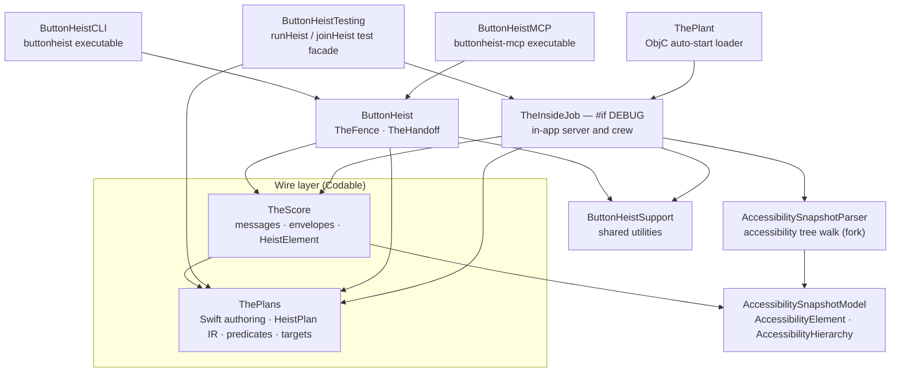

# Crew Map

Every module in the workspace and the direction of its dependencies, with the Codable wire boundary drawn explicitly. This diagram answers "which module owns what, and which types are allowed to cross the wire?"

**Illustrates:** [ARCHITECTURE.md](../ARCHITECTURE.md), [API.md](../API.md)
**Source of truth:** `Package.swift`, `ButtonHeistCLI/Package.swift`, `ButtonHeistMCP/Package.swift`

The SwiftPM tool executables are omitted from the picture to keep it narrow; `HeistPlanTool` (`heist-plan`) depends on `ThePlans` and `ArgumentParser`. `ButtonHeistCLI` also depends on `ThePlans` directly, and `ButtonHeist` on `AccessibilitySnapshotModel`.

Crew members inside `TheInsideJob` (directories under `ButtonHeist/Sources/TheInsideJob/`):

| Crew member | Responsibility |
|---|---|
| `TheBrains` | One `HeistExecution` reducer plus its MainActor effect host for control flow, actions, waits, and result accumulation |
| `TheGetaway` | Message encoding/decoding and transport routing |
| `TheSafecracker` | Touch injection and text input dispatch |
| `TheVault` | Accessibility capture, current Observation Snapshot, ordered History/Stream, latest live evidence, target resolution, heistId assignment |
| `TheTripwire` | UIKit timing signals — animations, layout, window ordering, keyboard state |
| `Server` | `TheMuscle` admission and sessions, `NWListener`, Bonjour advertisement |
| `Lifecycle` | App lifecycle coordination and server startup/shutdown |

Host-side crew members live in the `ButtonHeist` library (`ButtonHeist/Sources/TheButtonHeist/`): `TheFence` (command catalog and dispatch for CLI and MCP) and `TheHandoff` (device discovery, TLS connection, version handshake).

Only the wire-layer types (`ThePlans`, `TheScore`) are Codable and cross the network. Everything inside `TheInsideJob` — `InterfaceObservation`, `InterfaceTree`, `LiveCapture`, `TheVault` state — stays in the app process.
